# Mohammed Muneef Mohammed Ghanem
**Full Stack Software Developer Portfolio**  
Building ERP, Healthcare, Desktop Applications and Data Analysis Solutions.

## About This Portfolio
This repository presents selected software projects developed by Mohammed Muneef.
The projects demonstrate experience in:
- Enterprise ERP Systems
- Point of Sale Applications
- Healthcare Platforms
- REST API Development
- Database Design
- React Applications
- Flutter Mobile Applications
- Python Data Analysis

*Some commercial projects are presented through screenshots and documentation due to client privacy.*

---

## Featured Projects

### 1. LifeOutlet ERP & POS System
**Enterprise Medical Supplies Management System**

#### Overview
A complete ERP and Point of Sale system developed for a medical supplies business.
The system automates:
- Sales operations
- Purchasing
- Inventory management
- Accounting operations
- Reporting

The system was designed and developed from database architecture to user interface and deployed for real business usage.

#### Screenshots
- **Dashboard**: Central dashboard displaying Sales statistics, Inventory alerts, and Financial summaries.
  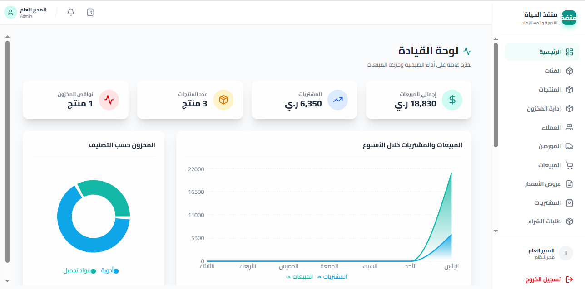
- **Point of Sale**: Fast sales interface supporting Product search, Barcode operations, Invoice generation, and Payment methods.
  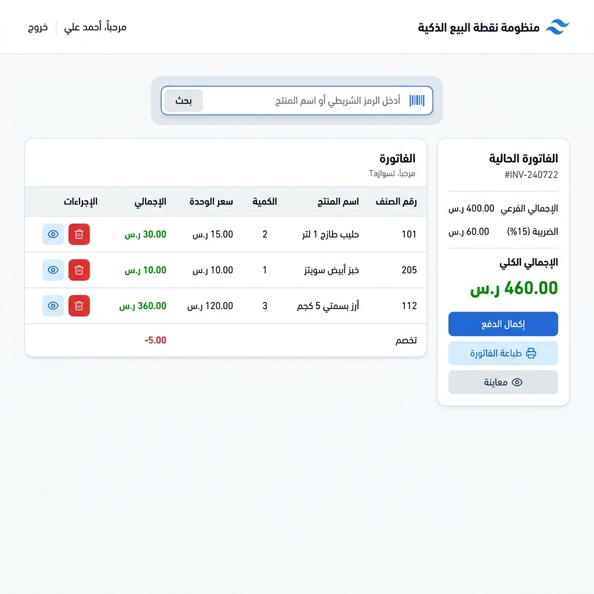
- **Inventory Management**: Features Stock tracking, Expiry date management, and FEFO methodology.
  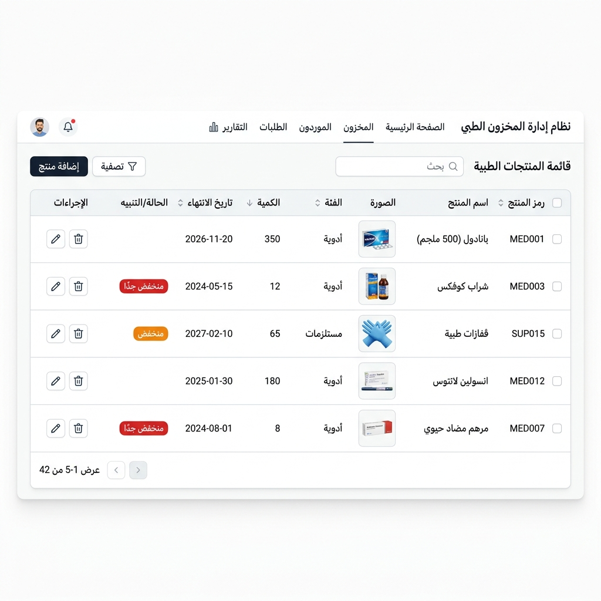
- **Financial Reports**: Includes Customer statements, Supplier statements, and Transaction tracking.
  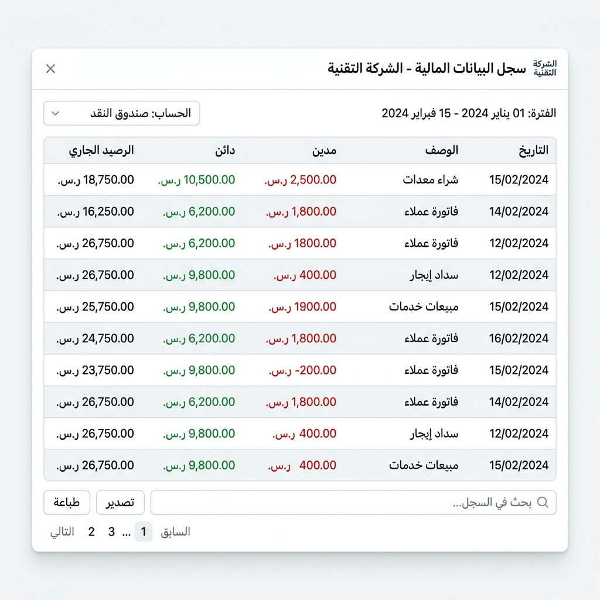
- **Printing System**: Custom printing engine supporting A4 reports and Thermal receipts.
  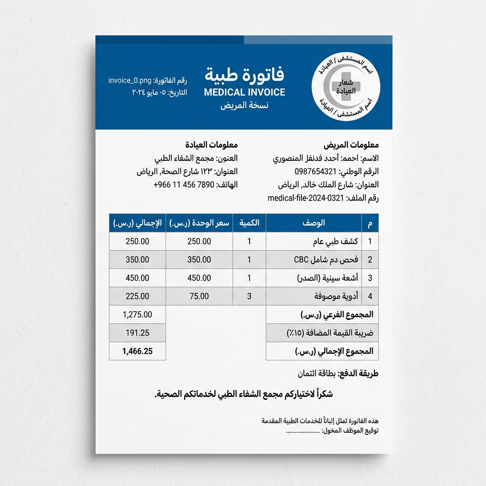

#### Technologies
`C#`, `.NET 9`, `ASP.NET Core Web API`, `React`, `TypeScript`, `PostgreSQL`, `Entity Framework Core`, `REST APIs`

#### Key Achievements
- Designed complete ERP architecture.
- Built secure authentication and authorization.
- Implemented pharmaceutical inventory tracking.
- Developed reporting and printing solutions.
- Prepared system for commercial deployment.

#### Status
Completed and actively used by a real business client.

[View Project Details](projects/lifeoutlet.md)

---

### 2. AwamTech Power ERP
**Electricity Station Management System**

#### Overview
Desktop ERP solution developed to automate electricity station operations.
The system manages:
- Customers
- Meter readings
- Billing
- Payments
- Notifications

#### Screenshots
- **Customer Management**: Manage subscribers, accounts and customer information.
  
- **Billing & Meter Reading**: Automated invoice generation based on Meter readings, Consumption, and Payments.
  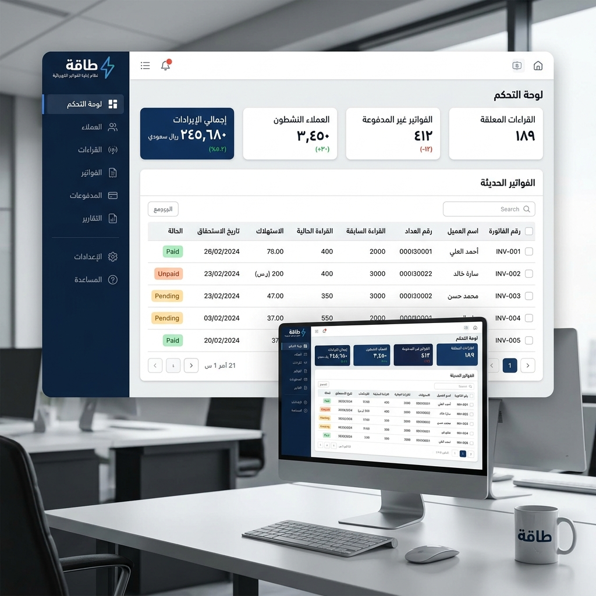
- **Financial Management**: Tracks Collections, Payments, and Financial operations.
  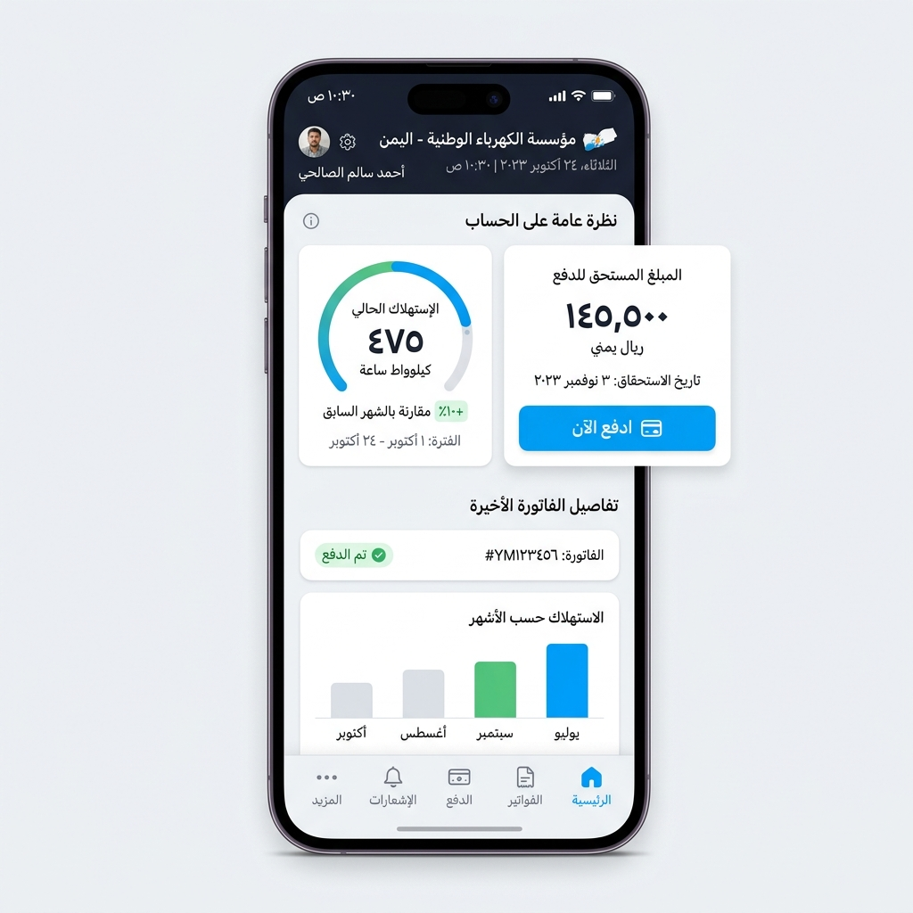
- **WhatsApp Notification System**: Automated invoice communication through WhatsApp integration.
  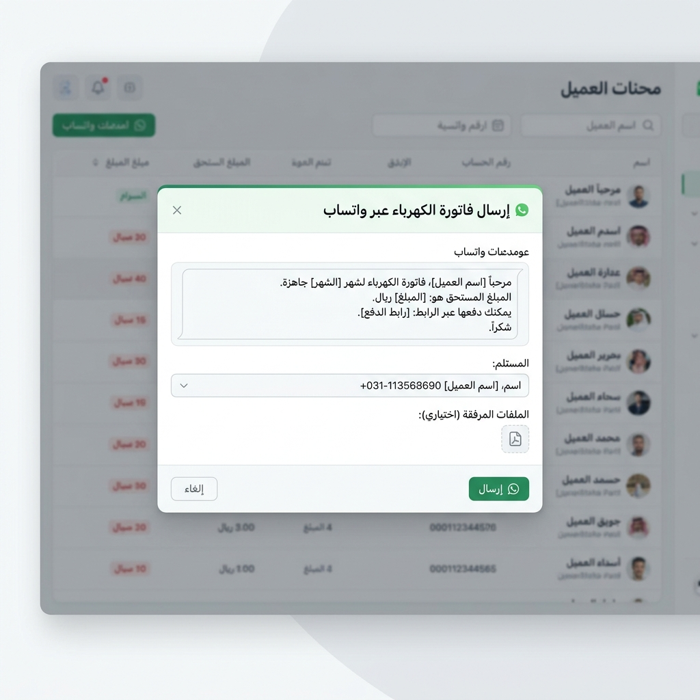

#### Technologies
`React`, `JavaScript`, `Electron`, `Node.js`, `Express.js`, `SQLite`

#### Key Achievements
- Developed complete desktop ERP architecture.
- Implemented offline hardware-based licensing.
- Built backup and restore functionality.
- Integrated WhatsApp notification workflow.
- Packaged as Windows executable application.

#### Deployment
Used by:
- 2 commercial electricity stations.
- More than 6,300 active subscribers.

[View Project Details](projects/awamtech.md)

---

### 3. My Prescription Healthcare Platform
**Healthcare & E-Pharmacy Platform**

#### Overview
Healthcare platform connecting patients with pharmacies to search for available medicines and nearby pharmacies.

#### Screenshots
- **Mobile Application**: Allows users to Search medicines and Find pharmacies.
  
- **Pharmacy Management**: Pharmacy owners can manage Medicines, Inventory, and Availability.
  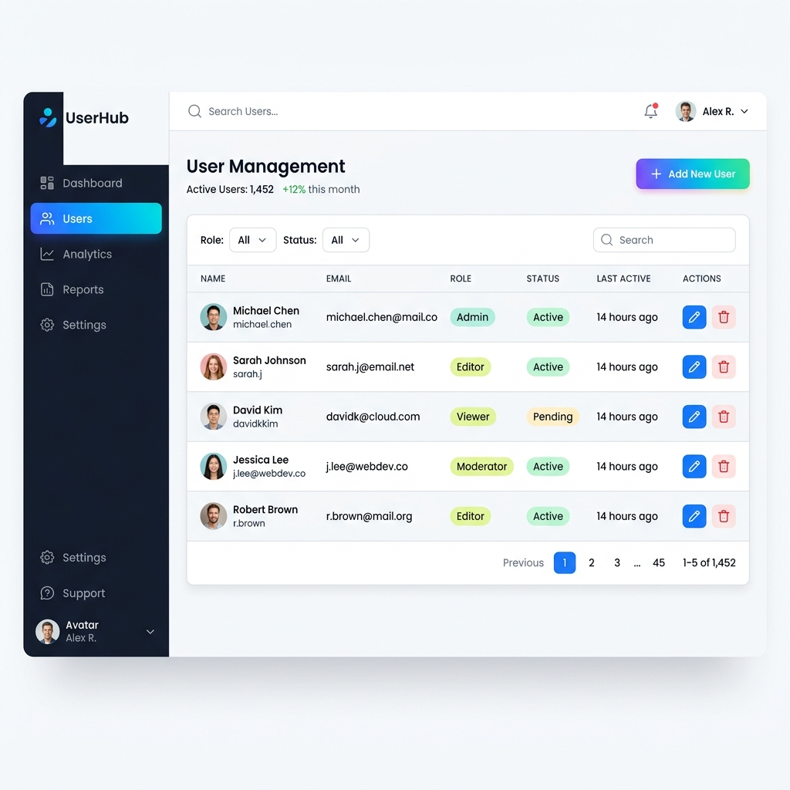
- **Admin Dashboard**: Management dashboard for Users, Pharmacies, and Statistics.
  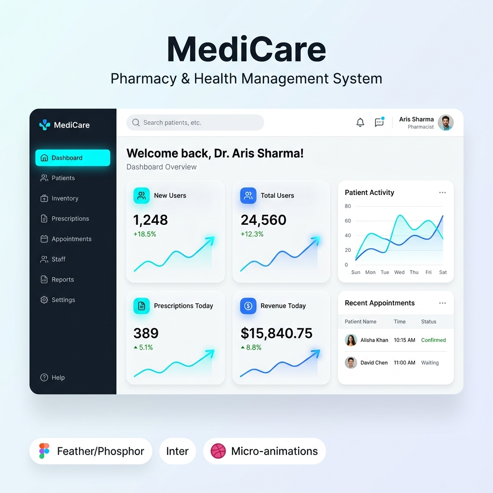
- **Medicine Search**: Smart medicine search based on availability.
  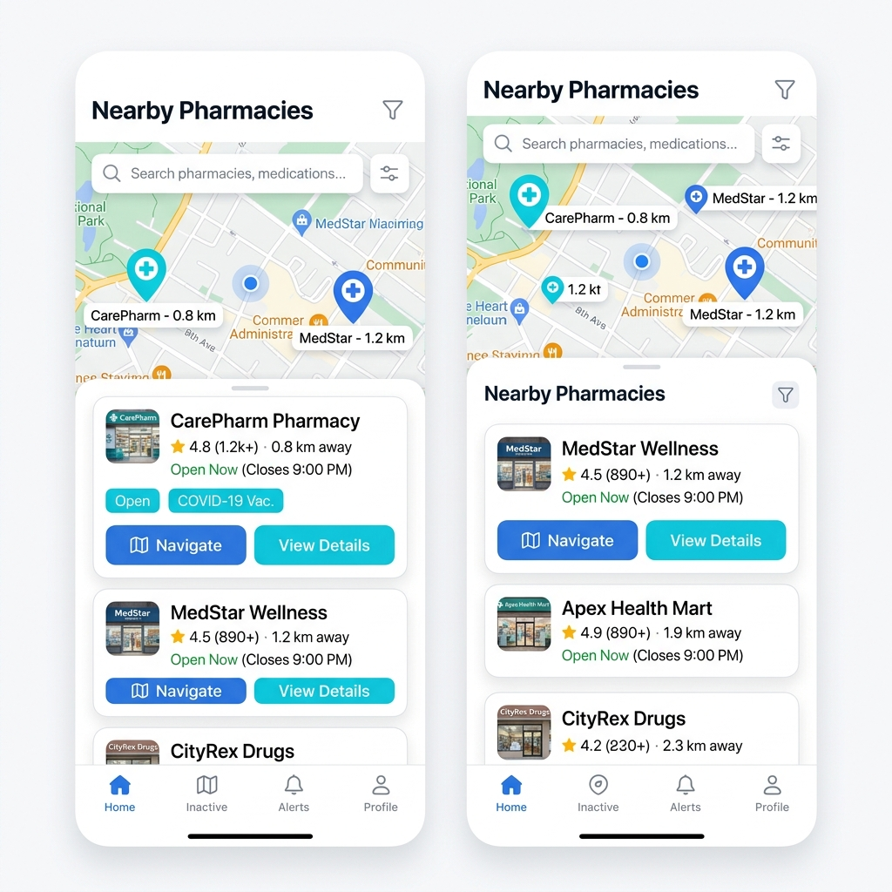

#### Technologies
`C#`, `ASP.NET Core`, `Flutter`, `Dart`, `PostgreSQL`, `Entity Framework Core`

#### Key Achievements
- Designed backend REST APIs.
- Built Flutter applications.
- Developed administration dashboard.
- Implemented location-based pharmacy search.
- Created medicine inventory management.

#### Status
Graduation project completed with excellent grade. Tested with 10 pharmacies during development.

[View Project Details](projects/prescription.md)

---

### 4. Python Data Analysis & Machine Learning Projects

#### Overview
Python projects focused on:
- Data processing
- Data visualization
- Machine learning fundamentals

#### Screenshots
- **Data Visualization**
  
- **Model Results**
  

#### Technologies
`Python`, `Pandas`, `NumPy`, `Matplotlib`, `Scikit-learn`, `Jupyter Notebook`

#### Implemented
- Data preprocessing.
- Exploratory data analysis.
- Regression models.
- Model evaluation.
- Data visualization.

[View Project Details](projects/python-data-analysis.md)

---

## Contact
- **Email:** [alimaps799@gmail.com](mailto:alimaps799@gmail.com)
- **LinkedIn:** [Mohammed Muneef](https://www.linkedin.com/in/mohammed-muneef-2649b3425)
- **GitHub:** [alimaps](https://github.com/alimaps)
- **Location:** Yemen | Available for Remote Work
